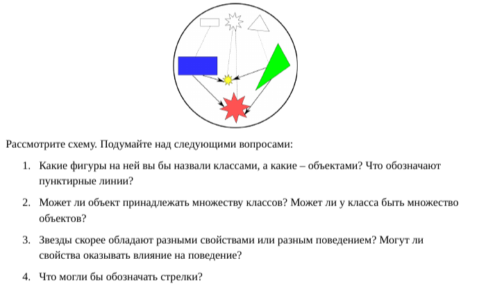

# Лабораторная работа на неделю 1
## **Тема**: Объектно-ориентированное программирование на Python 
### Студента группы ПИЖ-б-о-23-1(1) Дондаева Абу Умар-Пашаевича <br><br>
**Репозиторий Git:** https://github.com/Abu9541/OOP/tree/week_1  
**Практическая работа урока 1:**  
*Задание:*  
  
*Ответы:*
1. Черно-белые фигуры - это классы, а цветные - это объекты. Пунктирные линии обозначают принадлежность объекта классу.
2. В ООП один объект не может принадлежать нескольким классам, а вот у класса может быть множество объектов.
3. Звезды скорее обладают разными свойствами. Свойства могут оказывать влияние на поведение. Например, чем тяжелее предмет, тем он быстрее упадет с высоты.
4. Стрелки могут обозначать взаимодействие объектов.  


**Практическая работа урока 2:**  
*Задание:*  
Напишите программу по следующему описанию. Есть класс "Воин". От него создаются два экземпляра-юнита. Каждому устанавливается здоровье в 100 очков. В случайном порядке они бьют друг друга. Тот, кто бьет, здоровья не теряет. У того, кого бьют, оно уменьшается на 20 очков от одного удара. После каждого удара надо выводить сообщение, какой юнит атаковал, и сколько у противника осталось здоровья. Как только у кого-то заканчивается ресурс здоровья, программа завершается сообщением о том, кто одержал победу.  
*Ответ:*  
```python
from random import randint


class Warrior:

    health = 100

    def __init__(self, number: int):
        self.number = number

    def attack(self, unit):
        n = unit.number
        if self.health > 0:
            if unit.health > 0:
                unit.health -= 20
                print("Юнит", self.number, "ударил юнита", n, ".\nY юнита", n, "осталось", unit.health, "здоровья.")
                if unit.health <= 0:
                    print("Юнит", self.number, "победил!")
            else:
                print("Юнит", n, "уже мертв.")
        else:
            print("Юниту", self.number, "не хватает здоровья, чтобы ударить. Он умер.")


def start_fight(unit1, unit2):
    number_list = [unit1.number, unit2.number]
    while unit1.health > 0 and unit2.health > 0:
        n = randint(0, 1)
        if number_list[n] == unit1.number:
            unit1.attack(unit2)
        else:
            unit2.attack(unit1)


unit_1 = Warrior(1)
unit_2 = Warrior(2)
start_fight(unit_1, unit_2)
```
**Практическая работа урока 3:**  
*Задание:*  
Напишите программу по следующему описанию:  
1. Есть класс Person, конструктор которого принимает три параметра (не учитывая self) - имя, фамилию и квалификацию специалиста. Квалификация имеет значение заданное по-умолчанию, равное единице.
2. У класса Person есть метод, который возвращает строку, включающую в себя всю информацию о сотруднике.
3. Класс Person содержит деструктор, который выводит на экран фразу "До свидания, мистер ... " (вместо троеточия должны выводиться имя и фамилия объекта).
4. В основной ветке программы создайте три объекта класса Person. Посмотрите информацию о сотрудниках и увольте самое слабое звено.
5. В конце программы добавьте функцию input(), чтобы скрипт не завершился сам, пока не будет нажат Enter. Иначе вы сразу увидите как удаляются все объекты при завершении работы программы.  

*Ответ:*  
```python
class Person:

    def __init__(self, name: str, surname: str, qualification: int = 1):
        self.name = name
        self.surname = surname
        self.qualification = qualification

    def info(self):
        print(f'Имя и фамилия: {self.name} {self.surname}. Квалификация: {self.qualification}')

    def __del__(self):
        print(f'До свидания, мистер {self.name} {self.surname}.')


Toby = Person('Toby', 'Maguire', 3)
Andrew = Person('Andrew', 'Garfield', 2)
Tom = Person('Tom', 'Holland')
Toby.info()
Andrew.info()
Tom.info()
del Tom
close = input()
```   
**Практическая работа урока 4:**  
*Задание:*  
Разработайте программу по следующему описанию.  
В некой игре-стратегии есть солдаты и герои. У всех есть свойство, содержащее уникальный номер объекта, и свойство, в котором хранится принадлежность команде. У солдат есть метод "иду за героем", который в качестве аргумента принимает объект типа "герой". У героев есть метод увеличения собственного уровня.  
В основной ветке программы создается по одному герою для каждой команды. В цикле генерируются объекты-солдаты. Их принадлежность команде определяется случайно. Солдаты разных команд добавляются в разные списки.  
Измеряется длина списков солдат противоборствующих команд и выводится на экран. У героя, принадлежащего команде с более длинным списком, поднимается уровень.  
Отправьте одного из солдат первого героя следовать за ним. Выведите на экран идентификационные номера этих двух юнитов.  
*Ответ:*  
```python
from random import randint


class Person:

    id = 0

    def __init__(self, number_of_team: int):
        self.id = Person.id
        Person.id += 1
        self.number_of_team = number_of_team


class Hero(Person):

    def __init__(self, number_of_team: int):
        Person.__init__(self, number_of_team)
        self.level = 0

    def level_up(self):
        self.level += 1


class Soldier(Person):

    def __init__(self, number_of_team: int):
        Person.__init__(self, number_of_team)
        self.hero_followed = -1

    def follow_hero(self, hero: Hero):
        self.hero_followed = hero.level


hero_1 = Hero(1)
hero_2 = Hero(2)
soldiers_1 = []
soldiers_2 = []
for i in range(10):
    n = randint(1, 2)
    if n == 1:
        soldiers_1.append(Soldier(1))
    else:
        soldiers_2.append(Soldier(2))
print(f'Количество солдат в войске первого героя: {len(soldiers_1)}. Второго: {len(soldiers_2)}.')
if len(soldiers_1) > len(soldiers_2):
    hero_1.level_up()
else:
    hero_2.level_up()
soldiers_1[0].follow_hero(hero_1)
print(soldiers_1[0].id, hero_1.id)
```
**Практическая работа урока 5:**  
*Задание:*
В качестве практической работы попробуйте самостоятельно перегрузить оператор сложения. Для его перегрузки используется метод __add__(). Он вызывается, когда объекты класса, имеющего данный метод, фигурируют в операции сложения, причем с левой стороны. Это значит, что в выражении а + b у объекта а должен быть метод __add__(). Объект b может быть чем угодно, но чаще всего он бывает объектом того же класса. Объект b будет автоматически передаваться в метод __add__() в качестве второго аргумента (первый - self).  
Отметим, в Python также есть правосторонний метод перегрузки сложения - __radd__().  
Согласно полиморфизму ООП, возвращать метод __add__() может что угодно. Может вообще ничего не возвращать, а "молча" вносить изменения в какие-то уже существующие объекты. Допустим, в вашей программе метод перегрузки сложения будет возвращать новый объект того же класса.  
*Ответ:*  
```python
class Table:

    def __init__(self, width, height):
        self.width = width
        self.height = height

    def __add__(self, other):
        return self.width + other.width


table_1 = Table(5, 2.5)
table_2 = Table(3, 1.5)
print(f'Длина обоих столов вместе: {table_1 + table_2} метров.')
```  
**Практическая работа урока 6:**  
*Задание:*  
Разработайте класс с "полной инкапсуляцией", доступ к атрибутам которого и изменение данных реализуются через вызовы методов. В объектно-ориентированном программировании принято имена методов для извлечения данных начинать со слова get (взять), а имена методов, в которых свойствам присваиваются значения, - со слова set (установить). Например, getField, setField.  
*Ответ:*  
```python
class Game:

    recommended_ram: int = 0
    recommended_cpu: str = ''
    recommended_video_card: str = ''

    def __init__(self, name: str):
        self.name = name

    def set_recommended_ram(self, ram):
        self.recommended_ram = ram

    def set_recommended_cpu(self, cpu):
        self.recommended_cpu = cpu

    def set_recommended_video_card(self, video_card):
        self.recommended_video_card = video_card

    def get_name(self):
        return self.name

    def get_recommended_ram(self):
        return self.recommended_ram

    def get_recommended_cpu(self):
        return self.recommended_cpu

    def get_recommended_video_card(self):
        return self.recommended_video_card

    def __setattr__(self, attr, value):
        if attr == 'name':
            self.__dict__[attr] = value
        elif attr == 'recommended_ram':
            self.__dict__[attr] = value
        elif attr == 'recommended_cpu':
            self.__dict__[attr] = value
        elif attr == 'recommended_video_card':
            self.__dict__[attr] = value
        else:
            raise AttributeError

    def __str__(self):
        return (f'Название игры: {self.get_name()}.\nРекомендуемые настройки:\n'
                f'ОЗУ - {self.get_recommended_ram()} ГБ;\n'
                f'Процессор - {self.get_recommended_cpu()};\n'
                f'Видеокарта - {self.get_recommended_video_card()}.')


game_1 = Game('GTA 5')
game_1.set_recommended_ram(8)
game_1.set_recommended_cpu("Intel Core i3 5500")
game_1.set_recommended_video_card("GTX 1660 Super")
print(game_1)
```  
**Практическая работа урока 7:**  
*Задание:*  
Исправьте код так, чтобы у объектов Room были только четыре поля - width, lenght, height и wd. Площади (полная и оклеиваемая) должны вычислять лишь при необходимости путем вызова методов.  
Программа вычисляет площадь под оклейку, но ничего не говорит о том, сколько потребуется рулонов обоев. Добавьте метод, который принимает в качестве аргументов длину и ширину одного рулона, а возвращает количество необходимых, исходя из оклеиваемой площади.  
Разработайте интерфейс программы. Пусть она запрашивает у пользователя данные и выдает ему площадь оклеиваемой поверхности и количество необходимых рулонов.  
*Ответ:*  
```python
from math import ceil


class WinDoor:

    def __init__(self, x, y):
        self.square = x * y


class Room:

    def __init__(self, x, y, z):
        self.length = x
        self.width = y
        self.height = z
        self.wd = []

    def add_wd(self, w, h):
        self.wd.append(WinDoor(w, h))

    def square(self):
        return 2 * self.height * (self.width + self.length)

    def work_surface(self):
        new_square = self.square()
        for i in self.wd:
            new_square -= i.square
        return new_square

    def roll_needed(self, w, h):
        work_square = self.work_surface()
        roll_square = w * h
        return ceil(work_square / roll_square)


def program():
    print('Напишите длины сторон комнаты:')
    x = float(input('Длина: '))
    y = float(input('Ширина: '))
    z = float(input('Высота: '))
    room = Room(x, y, z)
    print('Сколько окон в этой комнате?')
    num_of_wins = int(input())
    length_of_wins = float(input('Длина окна: '))
    width_of_wins = float(input('Ширина окна: '))
    for i in range(num_of_wins):
        room.add_wd(width_of_wins, length_of_wins)
    print('Сколько дверей в этой комнате?')
    num_of_doors = int(input())
    length_of_doors = float(input('Длина двери: '))
    width_of_doors = float(input('Ширина двери: '))
    for i in range(num_of_doors):
        room.add_wd(width_of_doors, length_of_doors)
    print(f'Комната {x}x{y}x{z} метров создана. В ней: окон - {num_of_wins}, дверей - {num_of_doors}.')
    print('Напишите размеры рулона обоев, чтобы вычислить их количество, необходимое для обклейки комнаты.')
    length_of_roll = float(input('Длина: '))
    width_of_roll = float(input('Ширина: '))
    print(f'Оклеиваемая площадь комнаты составляет {room.work_surface()}. '
          f'Количество необходимых рулонов - {room.roll_needed(length_of_roll, width_of_roll)}')


program()
```  
**Практическая работа урока 8:**  
*Задание:*  
Напишите класс Snow по следующему описанию.  
В конструкторе класса инициируется поле, содержащее количество снежинок, выраженное целым числом.  
Класс включает методы перегрузки арифметических операторов: _add_() -сложение, _sub_() - вычитание, _mul_() - умножение, _truediv_() - деление. В классе код этих методов должен выполнять увеличение или уменьшение количества снежинок на число n или в n раз. Метод _truediv_() перегружает обычное (), а не целочисленное (//) деление. Однако пусть в методе происходит округление значения до целого числа.  
Класс включает метод makeSnow(), который принимает сам объект и число снежинок в ряду, а возвращает строку вида " ***** \n ***** \n *****... ", где количество снежинок между "\n' равно переданному аргументу, а количество рядов вычисляется, исходя из общего количества снежинок.  
Вызов объекта класса Snow в нотации функции с одним аргументом, должен приводить к перезаписи значения поля, в котором хранится количество снежинок, на переданное в качестве аргумента значение.  
*Ответ:*  
```python
class Snow:

    def __init__(self, num_of_snowflakes):
        self.num_of_snowflakes = num_of_snowflakes

    def __add__(self, n):
        self.num_of_snowflakes += n
        return self.num_of_snowflakes

    def __sub__(self, n):
        self.num_of_snowflakes -= n
        return self.num_of_snowflakes

    def __mul__(self, n):
        self.num_of_snowflakes *= n
        return self.num_of_snowflakes

    def __truediv__(self, n):
        self.num_of_snowflakes /= n
        int(self.num_of_snowflakes)
        return self.num_of_snowflakes

    def make_snow(self, n):
        new_num = self.num_of_snowflakes
        while new_num > n:
            print('*'*n)
            new_num -= n
        print('*'*new_num)

    def __call__(self, arg):
        self.num_of_snowflakes = arg

    def __repr__(self):
        return str(self.num_of_snowflakes)


snow = Snow(10)
print(snow)
print(snow + 10)
print(snow * 2)
print(snow - 2)
snow.make_snow(5)
```  
**Практическая работа урока 9:**  
*Задание:*  
В практической работе урока 7 "Композиция" требовалось разработать интерфейс взаимодействия с пользователем. Разнесите сам класс и интерфейс по разным файлам. Какой из них выполняет роль модуля, а какой - скрипта? Оба файла можно поместить в один каталог.  
*Ответ:*  
Содержимое файла lesson_9/room.py:  
```python
from math import ceil


class WinDoor:

    def __init__(self, x, y):
        self.square = x * y


class Room:

    def __init__(self, x, y, z):
        self.length = x
        self.width = y
        self.height = z
        self.wd = []

    def add_wd(self, w, h):
        self.wd.append(WinDoor(w, h))

    def square(self):
        return 2 * self.height * (self.width + self.length)

    def work_surface(self):
        new_square = self.square()
        for i in self.wd:
            new_square -= i.square
        return new_square

    def roll_needed(self, w, h):
        work_square = self.work_surface()
        roll_square = w * h
        return ceil(work_square / roll_square)
```   
Содержимое файла lesson_9/program.py:  
```python
import room


def program():
    print('Напишите длины сторон комнаты:')
    x = float(input('Длина: '))
    y = float(input('Ширина: '))
    z = float(input('Высота: '))
    room_1 = room.Room(x, y, z)
    print('Сколько окон в этой комнате?')
    num_of_wins = int(input())
    length_of_wins = float(input('Длина окна: '))
    width_of_wins = float(input('Ширина окна: '))
    for i in range(num_of_wins):
        room_1.add_wd(width_of_wins, length_of_wins)
    print('Сколько дверей в этой комнате?')
    num_of_doors = int(input())
    length_of_doors = float(input('Длина двери: '))
    width_of_doors = float(input('Ширина двери: '))
    for i in range(num_of_doors):
        room_1.add_wd(width_of_doors, length_of_doors)
    print(f'Комната {x}x{y}x{z} метров создана. В ней: окон - {num_of_wins}, дверей - {num_of_doors}.')
    print('Напишите размеры рулона обоев, чтобы вычислить их количество, необходимое для обклейки комнаты.')
    length_of_roll = float(input('Длина: '))
    width_of_roll = float(input('Ширина: '))
    print(f'Оклеиваемая площадь комнаты составляет {room_1.work_surface()}. '
          f'Количество необходимых рулонов - {room_1.roll_needed(length_of_roll, width_of_roll)}')


program()
```   
**Практическая работа урока 10:**  
*Задание:*  
Выполните полное документирование модуля, созданного в практической работе прошлого урока.  
*Ответ:*  
Содержимое файла lesson_9/room.py после документирования:  
```python
"""Модуль содержит классы комнат, окон и дверей."""

"""Импортируем метод округления числа вверх"""
from math import ceil


"""Класс, отвечающий за создание окон и дверей в комнате"""


class WinDoor:

    """Конструктор класса. Возвращает площадь окна или двери"""
    def __init__(self, x, y):
        self.square = x * y


"""Класс, отвечающий за создание комнаты"""


class Room:

    """Конструктор класса.
    Создает комнату размерами x*y*z и пустой список wd, в который будут записываться площади окон и дверей"""
    def __init__(self, x, y, z):
        self.length = x
        self.width = y
        self.height = z
        self.wd = []

    """Метод, добавляющий окно или дверь в список wd"""
    def add_wd(self, w, h):
        self.wd.append(WinDoor(w, h))

    """Метод подсчета площади оклеиваемых стен комнаты"""
    def square(self):
        return 2 * self.height * (self.width + self.length)

    """Метод подсчета площади оклеиваемых стен комнаты с учетом окон и дверей"""
    def work_surface(self):
        new_square = self.square()
        for i in self.wd:
            new_square -= i.square
        return new_square

    """Метод подсчета количества необходимых рулонов обоев для оклеивания комнаты"""
    def roll_needed(self, w, h):
        work_square = self.work_surface()
        roll_square = w * h
        return ceil(work_square / roll_square)
```  
**Практическая работа урока 11:**  
*Задание:*  
Может ли в этой программе ученик учиться без учителя? Если да, пусть научится чему-нибудь сам.  
Добавьте в класс Pupil метод, позволяющий ученику случайно "забывать" какую-нибудь часть своих знаний.  
*Ответ:*  
Ученик может научиться чему-то сам, для этого достаточно вызвать метод take() для объекта класса Pupil и передать ему тему.  
Чтобы добавить возможность забывать материал, в класс Pupil добавим новую функцию:  
```python
from random import randint

class Pupil:

    def forget(self):
        n = randint(0, len(self.knowledge)-1)
        self.knowledge.remove(n)
```
