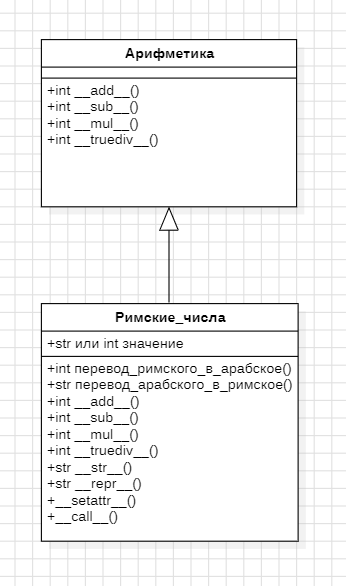

# Лабораторная работа на неделю 3
## **Тема**: Объектно-ориентированное программирование на Python 
### Студента группы ПИЖ-б-о-23-1(1) Дондаева Абу Умар-Пашаевича <br><br>
**Репозиторий Git:** https://github.com/Abu9541/pizh2311_dondaev  
**Вариант: 8**  
**Практическая работа:**  

*Задание 1:*  

Создайте класс Roman (РимскоеЧисло), представляющий римское число и поддерживающий операции +, -, *, /.    
Совет:  
При реализации класса следуйте рекомендациям:  
· операции +, -, *, / реализуйте как специальные методы (__ add __ и др.);  
· методы преобразования имеет смысл реализовать как статические методы, позволяя не создавать экземпляр объекта в случае, если необходимо выполнить только преобразования чисел.  
При выполнении задания необходимо построить UML-диаграмма классов приложения.  

*Ответ:*  
```python
import abc


class Arithmetic:
    """
    Абстрактный класс для арифметических действий.
    В данном классе есть следующие абстрактные методы: сложение, вычитание, умножение и деление.
    """

    @abc.abstractmethod
    def __add__(self, other):
        raise NotImplementedError("Нельзя вызывать абстрактный метод!")

    @abc.abstractmethod
    def __sub__(self, other):
        raise NotImplementedError("Нельзя вызывать абстрактный метод!")

    @abc.abstractmethod
    def __mul__(self, other):
        raise NotImplementedError("Нельзя вызывать абстрактный метод!")

    @abc.abstractmethod
    def __truediv__(self, other):
        raise NotImplementedError("Нельзя вызывать абстрактный метод!")


class Roman(Arithmetic):
    """
    Класс римских чисел.
    В классе реализованы методы перевода римских чисел в арабские и наоборот,
    сложения, вычитания, умножения и деления римских чисел.
    """

    @staticmethod
    def roman_to_int(roman: str):
        """
        Метод перевода римского числа в арабское.
        Принимает римское число в виде строки.
        Возвращает арабское число.
        """
        roman_numerals = {'I': 1, 'V': 5, 'X': 10, 'L': 50, 'C': 100, 'D': 500, 'M': 1000}
        arabic = 0
        prev_value = 0
        for char in reversed(roman):
            value = roman_numerals[char]
            if value < prev_value:
                arabic -= value
            else:
                arabic += value
            prev_value = value
        return arabic

    @staticmethod
    def int_to_roman(arabic: int):
        """
        Метод перевода арабского числа в римское.
        Принимает целое число.
        Возвращает римское число в виде строки.
        """
        val = [
            1000, 900, 500, 400,
            100, 90, 50, 40,
            10, 9, 5, 4,
            1
        ]
        syms = [
            "M", "CM", "D", "CD",
            "C", "XC", "L", "XL",
            "X", "IX", "V", "IV",
            "I"
        ]
        roman_num = ''
        i = 0
        while arabic > 0:
            for _ in range(arabic // val[i]):
                roman_num += syms[i]
                arabic -= val[i]
            i += 1
        return roman_num

    def __init__(self, value):
        """
        Конструктор класса.
        Принимает целочисленное или строковое значение.
        Если значение целочисленное, просто присваивает его полю класса Roman.
        Если число строковое, переводит его в целочисленное и присваивает полю класса Roman.
        :param value:
        """
        if isinstance(value, str):
            self.value = self.roman_to_int(value)
        elif isinstance(value, int):
            self.value = value
        else:
            raise ValueError("Значение должно быть строковым (римское число) или целым (арабское число).")

    def __add__(self, other):
        """
        Перегрузка методов класса: сложение.
        Принимает два объекта и складывает их.
        Возвращает результат сложения.
        """
        if isinstance(other, Roman):
            return Roman(self.value + other.value)
        else:
            return Roman(self.value + other)

    def __sub__(self, other):
        """
        Перегрузка методов класса: вычитание.
        Принимает два объекта и вычитает второе от первого.
        Возвращает результат вычитания.
        """
        if isinstance(other, Roman):
            return Roman(self.value - other.value)
        else:
            return Roman(self.value - other)

    def __mul__(self, other):
        """
        Перегрузка методов класса: умножение.
        Принимает два объекта и умножает их.
        Возвращает результат умножения.
        """
        if isinstance(other, Roman):
            return Roman(self.value * other.value)
        else:
            return Roman(self.value * other)

    def __truediv__(self, other):
        """
        Перегрузка методов класса: целочисленное деление.
        Принимает два объекта и делит первое на второе.
        Возвращает результат деления.
        """
        if isinstance(other, Roman):
            return Roman(self.value // other.value)
        else:
            return Roman(self.value // other)

    def __str__(self):
        """
        Перегрузка методов класса: вывод объекта через print().
        Возвращает римское число.
        """
        return self.int_to_roman(self.value)

    def __repr__(self):
        """
        Перегрузка методов класса: вывод объекта при запросе его в виде строки.
        Возвращает строку f"Roman('{self.int_to_roman(self.value)}')".
        """
        return f"Roman('{self.int_to_roman(self.value)}')"

    def __setattr__(self, attr, value):
        """
        Метод перегрузки установки новых атрибутов. Осуществляет инкапсуляцию.
        """
        if attr == 'value':
            self.__dict__[attr] = value
        else:
            raise AttributeError

    def __call__(self, value):
        """
        Метод перегрузки вызова класса. Переопределяет значение объекта.
        """
        if isinstance(value, str):
            self.value = self.roman_to_int(value)
        elif isinstance(value, int):
            self.value = value
        else:
            raise ValueError("Значение должно быть строковым (римское число) или целым (арабское число).")


# Проверка кода
a = Roman("X")
b = Roman("V")

print(a + b)  # XV
print(a - b)  # V
print(a * b)  # L
print(a / b)  # II

a(25)

print(a + b)  # XXX
print(a - b)  # XX
print(a * b)  # CXXV
print(a / b)  # V
```   
UML-диаграмма классов:  

  

*Задание 2:*  

Пиццерия предлагает клиентам три вида пиццы: Пепперони, Барбекю и Дары Моря, каждая из которых определяется тестом, соусом и начинкой.  
Требуется спроектировать и реализовать приложение для терминала, позволяющее обеспечить обслуживание посетителей.  
Дополнительная информация:  
В бизнес-процессе работы пиццерии в контексте задачи можно выделить 3 сущности (объекта):  
· Терминал: отвечает за взаимодействие с пользователем: 

   1. вывод меню на экран;  
   2. прием команд от пользователя (выбор пиццы, подтверждение заказа, оплата и др.);  

· Заказ: содержит список заказанных пицц, умеет подсчитывать свою стоимость;  
· Пицца: содержит заявленные характеристики пиццы, а также умеет себя подготовить (замесить тесто, собрать ингредиенты и т.д.), испечь, порезать и упаковать.  
Т.к. пиццерия реализует несколько видов пиццы, которые различаются характеристиками, логично будет сделать общий класс Пицца, а в дочерних классах (например, классе ПиццаБарбекю) уточнить характеристики конкретной пиццы.  

*Ответ:*  
```python
class Pizza:
    """
    Класс Пицца для инициализации пиццы с ее названием, видом теста,
    соусом, начинкой и ценой.
    Реализованы методы готовки пиццы, ее выпечки, нарезки и упаковки.
    """

    def __init__(self, name: str, dough: str, sauce: str, toppings: list, price: float):
        """
        Конструктор класса. Принимает и присваивает следующие параметры полям класса:
        название пиццы, тесто, соус, начинка, цена.
        """
        self.name = name
        self.dough = dough
        self.sauce = sauce
        self.toppings = toppings
        self.price = price

    def prepare(self):
        """
        Метод, имитирующий готовку пиццы. Ничего не принимает.
        Выводит информацию о стадии готовки пиццы.
        """
        print(f"Готовим {self.name}...")
        print(f"Замешиваем тесто: {self.dough}...")
        print(f"Добавляем соус: {self.sauce}...")
        print(f"Добавляем начинку: {', '.join(self.toppings)}...")
        print("Пицца готова к выпечке.")

    def bake(self):
        """
        Метод, имитирующий выпечку пиццы. Ничего не принимает.
        Выводит информацию о том, что пицца выпекается.
        """
        print(f"Выпекаем {self.name}...")
        print("Пицца выпечена.")

    def cut(self):
        """
        Метод, имитирующий резку пиццы. Ничего не принимает.
        Выводит информацию о том, что пицца режется.
        """
        print(f"Режем {self.name}...")
        print("Пицца разрезана по кускам.")

    def pack(self):
        """
        Метод, имитирующий упаковку пиццы. Ничего не принимает.
        Выводит информацию о том, что пицца упаковывается.
        """
        print(f"Упаковываем {self.name}...")
        print("Пицца упакована.")

    def __str__(self):
        """
        Перегрузка методов класса: вывод объекта через print().
        Возвращает название пиццы и ее стоимость.
        """
        return f"{self.name} - {self.price} руб."


class PepperoniPizza(Pizza):
    """
    Класс Пепперони - наследник класса Пицца.
    Содержит конструктор класса для инициализации пиццы Пепперони.
    """

    def __init__(self):
        """
        Конструктор класса. Инициализирует пиццу с определенным составом.
        """
        super().__init__("Пепперони", "тонкое тесто", "томатный соус", ["пепперони", "сыр моцарелла"], 250.55)


class BarbecuePizza(Pizza):
    """
    Класс Барбекю - наследник класса Пицца.
    Содержит конструктор класса для инициализации пиццы Барбекю.
    """

    def __init__(self):
        """
        Конструктор класса. Инициализирует пиццу с определенным составом.
        """
        super().__init__("Барбекю", "толстое тесто", "соус барбекю", ["курица", "лук", "сыр моцарелла"], 299.99)


class SeafoodPizza(Pizza):
    """
    Класс Дары моря - наследник класса Пицца.
    Содержит конструктор класса для инициализации пиццы Дары моря.
    """

    def __init__(self):
        """
        Конструктор класса. Инициализирует пиццу с определенным составом.
        """
        super().__init__("Дары Моря", "тонкое тесто", "сливочный соус", ["креветки", "мидии", "сыр моцарелла"], 350.55)


class Order:
    """
    Класс заказа. Реализованы методы добавления пиццы в заказ,
    сброса заказа, его вывода и завершения.
    """

    def __init__(self):
        """
        Конструктор класса. Инициализирует поля для списка пицц в заказе и общей суммы.
        """
        self.pizzas = []
        self.total = 0

    def add_pizza(self, pizza):
        """
        Метод, добавляющий в заказ пиццу. Принимает название пиццы и добавляет в список пицц.
        Ничего не возвращает.
        """
        self.pizzas.append(pizza)
        self.total += pizza.price
        print(f"Пицца {pizza.name} добавлена в заказ.")

    def reset(self):
        """
        Метод для сброса заказа. Ничего не принимает.
        Удаляет пиццы из списка пицц и обнуляет общую сумму.
        """
        self.pizzas.clear()
        self.total = 0

    def display_order(self):
        """
        Метод вывода заказа. Ничего не принимает.
        Выводит список пицц в заказе и общую сумму.
        """
        print("Ваш заказ:")
        for pizza in self.pizzas:
            print(f"- {pizza.name}")
        print(f"Итого: {self.total} руб.")

    @staticmethod
    def finish_order():
        """
        Метод завершения заказа. Ничего не принимает.
        Выводит сообщение о том, что заказ выполнен.
        """
        print(f"Заказ выполнен.")

    def __str__(self):
        """
        Перегрузка методов класса: вывод объекта через print().
        Возвращает список заказанных пицц.
        """
        return f"Заказанные пиццы: {self.pizzas}"


class Terminal:
    """
    Класс терминала. Инициализирует терминал для пользователя.
    Реализованы методы отображения меню, оформления и подтверждения заказа.
    """

    def __init__(self):
        """
        Конструктор класса. Инициализирует словарь, где числу соответствует один из классов-наследников класса Pizza. 
        """
        self.menu = {
            1: PepperoniPizza(),
            2: BarbecuePizza(),
            3: SeafoodPizza()
        }

    def display_menu(self):
        """
        Метод отображения меню. Ничего не принимает.
        Выводит меню кафе.
        """
        print("Меню:")
        for key, pizza in self.menu.items():
            print(f"{key}. {pizza.name} - {pizza.price} руб.")

    def take_order(self):
        """
        Метод для оформления заказа. Ничего не принимает.
        Возвращает готовый заказ.
        """
        order_1 = Order()
        while True:
            self.display_menu()
            choice = input("Выберите номер пиццы (или 'готово' для завершения, или 'отмена' для отмены): ")
            if choice.lower() == "готово":
                break
            elif choice.lower() == "отмена":
                order_1.reset()
            try:
                choice = int(choice)
                if choice in self.menu:
                    order_1.add_pizza(self.menu[choice])
                else:
                    print("Неверный выбор. Пожалуйста, выберите номер из меню.")
            except ValueError:
                print("Пожалуйста, введите номер пиццы.")
        return order_1

    @staticmethod
    def process_order(ordered):
        """
        Метод для подтверждения заказа. Принимает объект класса Order.
        Ничего не возвращает. Выводит информацию о подтверждении заказа.
        """
        ordered.display_order()
        confirm = input("Подтвердите заказ (да/нет): ")
        if confirm.lower() == 'да':
            print("Заказ подтвержден. Готовим ваши пиццы...")
            for pizza in ordered.pizzas:
                pizza.prepare()
                pizza.bake()
                pizza.cut()
                pizza.pack()
            print("Заказ готов! Спасибо за покупку!")
        else:
            print("Заказ отменен.")


# Пример использования
terminal = Terminal()
order = terminal.take_order()
terminal.process_order(order)
```  
