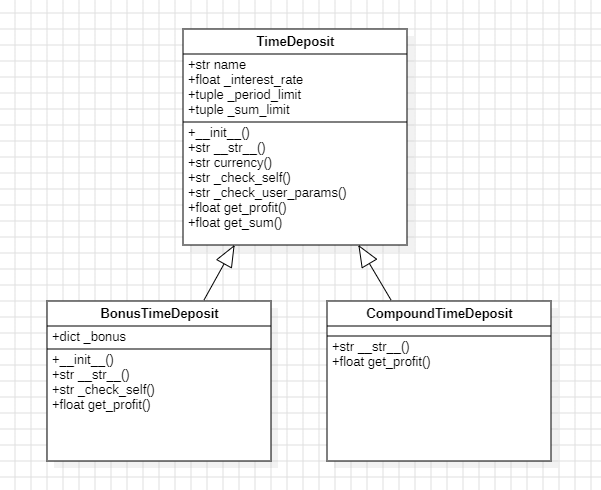
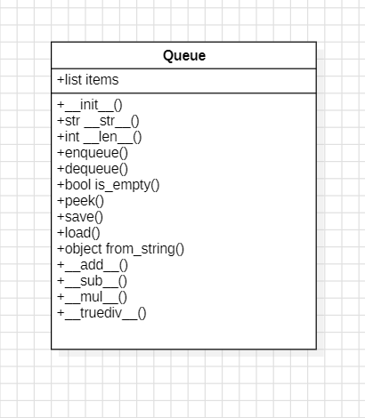

# Лабораторная работа на неделю 4
## **Тема**: Объектно-ориентированное программирование на Python 
### Студента группы ПИЖ-б-о-23-1(1) Дондаева Абу Умар-Пашаевича <br><br>
**Репозиторий Git:** https://github.com/Abu9541/pizh2311_dondaev  
**Вариант: 8**  
**Практическая работа:**  

*Задание 3:*  

Банк предлагает ряд вкладов для физических лиц:  
· Срочный вклад: расчет прибыли осуществляется по формуле простых процентов;  
· Бонусный вклад: бонус начисляется в конце периода как % от прибыли, если вклад больше определенной суммы;  
· Вклад с капитализацией процентов.  
Реализуйте приложение, которое бы позволило подобрать клиенту вклад по заданным параметрам.  
При выполнении задания необходимо построить UML-диаграмма классов приложения.   

*Ответ:*  
Код файла deposit.py:  
```python
class TimeDeposit:
    """
    Абстрактный класс - срочный вклад.
    Поля:
      - self.name (str): наименование;
      - self._interest_rate (float): процент по вкладу (0; 100];
      - self._period_limit (tuple (int, int)):
            допустимый срок вклада в месяцах [от; до);
      - self._sum_limit (tuple (float, float)):
            допустимая сумма вклада [от; до).
    Свойства:
      - self.currency (str): знак/наименование валюты.
    Методы:
      - self._check_self(initial_sum, period): проверяет соответствие данных
            ограничениям вклада;
      - self.get_profit(initial_sum, period): возвращает прибыль по вкладу;
      - self.get_sum(initial_sum, period):
            возвращает сумму по окончании вклада.
    """

    def __init__(self, name: str, interest_rate: float, period_limit: tuple, sum_limit: tuple):
        """
        Инициализировать атрибуты класса.
        """
        self.name = name
        self._interest_rate = interest_rate
        self._period_limit = period_limit
        self._sum_limit = sum_limit
        self._check_self()

    def __str__(self):
        """
        Вернуть строкое представление депозита.
        Формат вывода:

        Наименование:       Срочный Вклад
        Валюта:             руб.
        Процентная ставка:  5
        Срок (мес.):        [6; 18)
        Сумма:              [1,000; 100,000)
        """
        return (f"Наименование:       {self.name}\n"
                f"Валюта:             {self.currency}\n"
                f"Процентная ставка:  {self._interest_rate}\n"
                f"Срок (мес.):        [{self._period_limit[0]}; {self._period_limit[1]})\n"
                f"Сумма:              [{self._sum_limit[0]:,.0f}; {self._sum_limit[1]:,.0f})")

    @property
    def currency(self):
        return "руб."

    def _check_self(self):
        """
        Проверить, что данные депозита являются допустимыми.
        """
        assert 0 < self._interest_rate <= 100, "Неверно указан процент по вкладу!"
        assert 1 <= self._period_limit[0] < self._period_limit[1], "Неверно указаны ограничения по сроку вклада!"
        assert 0 < self._sum_limit[0] <= self._sum_limit[1], "Неверно указаны ограничения по сумме вклада!"

    def _check_user_params(self, initial_sum: float, period: int):
        """
        Проверить, что данные депозита соответствуют его ограничениям.
        """
        is_sum_ok = self._sum_limit[0] <= initial_sum < self._sum_limit[1]
        is_period_ok = self._period_limit[0] <= period < self._period_limit[1]
        assert is_sum_ok and is_period_ok, "Условия вклада не соблюдены!"

    def get_profit(self, initial_sum: float, period: int):
        """
        Вернуть прибыль по вкладу вклада клиента.
        Параметры:
          - initial_sum (float): первоначальная сумма;
          - period (int): количество месяцев размещения вклада.
        Формула:
          первоначальная_сумма * % / 100 * период / 12
        """
        self._check_user_params(initial_sum, period)
        return initial_sum * self._interest_rate / 100 * period / 12

    def get_sum(self, initial_sum: float, period: int):
        """
        Вернуть сумму вклада клиента после начисления прибыли.
        Параметры:
          - initial_sum (float): первоначальная сумма;
          - period (int): количество месяцев размещения вклада.
        """
        return initial_sum + self.get_profit(initial_sum, period)


class BonusTimeDeposit(TimeDeposit):
    """
    Cрочный вклад c получением бонуса к концу срока вклада.
    Бонус начисляется как % от прибыли, если вклад больше определенной суммы.
    Атрибуты:
      - self._bonus (dict ("percent"=int, "sum"=float)):
        % от прибыли, мин. сумма;
    """

    def __init__(self, name: str, interest_rate: float, period_limit: tuple, sum_limit: tuple, bonus: dict):
        """
        Инициализировать атрибуты класса.
        """
        self._bonus = bonus
        super().__init__(name, interest_rate, period_limit, sum_limit)
        self._check_self()

    def __str__(self):
        """
        Вернуть строкое представление депозита.
        К информации о родителе добавляется информацию о бонусе.
        Формат вывода:

        Наименование:       Бонусный Вклад
        Валюта:             руб.
        Процентная ставка:  5
        Срок (мес.):        [6; 18)
        Сумма:              [1,000; 100,000)
        Бонус (%):          5
        Бонус (мин. сумма): 2,000
        """
        return (super().__str__() + "\n" +
                f"Бонус (%):          {self._bonus['percent']}\n"
                f"Бонус (мин. сумма): {self._bonus['sum']:,.0f}")

    def _check_self(self):
        """
        Проверить, что данные депозита являются допустимыми.
        Дополняем родительский метод проверкой бонуса.
        """
        super()._check_self()
        assert 0 < self._bonus['percent'] <= 100, "Неверно указан процент бонуса!"
        assert 0 < self._bonus['sum'], "Неверно указана минимальная сумма для бонуса!"

    def get_profit(self, initial_sum: float, period: int):
        """
        Вернуть прибыль по вкладу вклада клиента.
        Параметры:
          - initial_sum (float): первоначальная сумма;
          - period (int): количество месяцев размещения вклада.
        Формула:
          - прибыль = сумма * процент / 100 * период / 12
        Для подсчета прибыли используется родительский метод.
        Далее, если первоначальная сумма > необходимой,
        начисляется бонус.
        """
        profit = super().get_profit(initial_sum, period)
        if initial_sum > self._bonus['sum']:
            profit += profit * self._bonus['percent'] / 100
        return profit


class CompoundTimeDeposit(TimeDeposit):
    """
    Срочный вклад c ежемесячной капитализацией процентов.
    """

    def __str__(self):
        """
        Вернуть строкое представление депозита.
        К информации о родителе добавляется информация о капитализации.
        Формат вывода:

        Наименование:       Вклад с Капитализацией
        Валюта:             руб.
        Процентная ставка:  5
        Срок (мес.):        [6; 18)
        Сумма:              [1,000; 100,000)
        Капитализация %   : Да
        """
        return super().__str__() + "\nКапитализация %   : Да"

    def get_profit(self, initial_sum: float, period: int):
        """
        Вернуть прибыль по вкладу вклада клиента.
        Параметры:
          - initial_sum (float): первоначальная сумма;
          - period (int): количество месяцев размещения вклада.
        Родительский метод для подсчета прибыли использовать не нужно,
        переопределив его полностью - расчет осуществляется по новой формуле.
        Капитализация процентов осуществляется ежемесячно.
        Нужно не забыть про самостоятельный вызов проверки параметров.
        Формула:
          первоначальная_сумма * (1 + % / 100 / 12) ** период -
          первоначальная_сумма
        """
        self._check_user_params(initial_sum, period)
        return initial_sum * (1 + self._interest_rate / 100 / 12) ** period - initial_sum


deposits_data_1 = dict(interest_rate=5, period_limit=(6, 18),
                       sum_limit=(1000, 100000))
deposits_data_2 = dict(interest_rate=5, period_limit=(6, 18),
                       sum_limit=(1000000, 5000000))

# Список имеющихся депозитов
deposits = (
    TimeDeposit("Сохраняй", interest_rate=5,
                period_limit=(6, 18),
                sum_limit=(1000, 100000)),
    BonusTimeDeposit("Бонусный 2", **deposits_data_1,
                     bonus=dict(percent=5, sum=2000)),
    CompoundTimeDeposit("С капитализацией", **deposits_data_1),
    TimeDeposit("Богач", interest_rate=5,
                period_limit=(6, 18),
                sum_limit=(1000000, 5000000)),
    BonusTimeDeposit("Бонусный с миллиона", **deposits_data_2,
                     bonus=dict(percent=2.5, sum=2000)),
    CompoundTimeDeposit("С капитализацией на миллион", **deposits_data_2)
)

```  
Код файла main.py:  
```python
from task_3_deposit import deposits


if __name__ == "__main__":
    print("Добро пожаловать в систему подбора вкладов!")

    while True:
        print("\n-----")
        print("Нажмите 1, чтобы подобрать вклад, или что угодно для выхода.")

        answer = input()
        if answer == "1":
            initial_sum = float(input("1/2: Введите начальную сумму вклада: "))
            period = int(input("2/2: Введите срок вклада (мес.): "))

            matched_deposits = []
            for deposit in deposits:
                try:
                    deposit._check_user_params(initial_sum, period)
                    matched_deposits.append(deposit)
                except AssertionError as err:
                    pass

            if len(matched_deposits) > 0:
                print("{0:18} | {1:13} | {2:13}".format(
                    "Вклад", "Прибыль", "Итоговая сумма"
                ))
                for deposit in matched_deposits:
                    print("{0:18} | {1:8,.2f} {3:4} | {2:8,.2f} {3:4}".format(
                          deposit.name,
                          deposit.get_profit(initial_sum, period),
                          deposit.get_sum(initial_sum, period),
                          deposit.currency))
            else:
                print("К сожалению, нет подходящих Вам вкладов.")

        else:
            break

    print("\nСпасибо, что воспользовались терминалом банка! До встречи!")

```  
Вывод программы:  

-----  
Нажмите 1, чтобы подобрать вклад, или что угодно для выхода.  
1  
1/2: Введите начальную сумму вклада: 51125.5  
2/2: Введите срок вклада (мес.): 12  
Вклад              | Прибыль       | Итоговая сумма  
Сохраняй           | 2,556.28 руб. | 53,681.78 руб.  
Бонусный 2         | 2,684.09 руб. | 53,809.59 руб.  
С капитализацией   | 2,615.68 руб. | 53,741.18 руб.
-----

UML-диаграмма классов:  
  

*Задание 4:*  

Вариант - Queue - Очередь.  
Прежде чем перейти к написанию кода:  
· изучите предметную область объекта и доступные операции;  
· для каждого поля и метода продумайте его область видимости, а также необходимость использования свойств.  
При реализации класс должен содержать:  
· специальные методы:  

1) __ init __(self, ... ) - инициализация с необходимыми параметрами;  
2) __ str __(self) - представление объекта в удобном для человека виде;  
3) специальные методы для возможности сложения, разности и прочих операций, которые класс должен поддерживать; 

· методы класса: 

1) from_string(cls, str_value) - создает объект на основании строки str_value; 

· поля, методы, свойства:  

1) поля, необходимые для выбранного класса;  
2) метод save(self, filename) - файл filename;  
3) метод load(self, filename) - загружает файла filename;  
4) прочие методы (не менее 3-х) и свойства, выявленные на этапе изучения класса.  

Реализуйте класс в отдельном модуле, а также создайте main.py, который бы тестировал все его возможности.  
При выполнении задания необходимо построить UML-диаграмма классов приложения.  

*Ответ:*  
Код файла queue.py:  
```python
import json


class Queue:
    """
    Класс, представляющий очередь Queue (FIFO).
    """

    def __init__(self, items: list = None):
        """
        Инициализация очереди.
        Принимает список значений очереди.
        """
        if items is None:
            self.items = []
        else:
            self.items = list(items)

    def __str__(self):
        """
        Метод перегрузки класса.
        Возвращает строковое представление очереди.
        """
        return f"Queue({self.items})"

    def __len__(self):
        """
        Метод перегрузки класса.
        Возвращает количество элементов в очереди.
        """
        return len(self.items)

    def enqueue(self, item):
        """
        Добавляет элемент в конец очереди.
        Принимает элемент, который необходимо добавить.
        """
        self.items.append(item)

    def dequeue(self):
        """
        Удаляет и возвращает элемент из начала очереди.
        """
        if self.is_empty():
            raise IndexError("Очередь пуста")
        return self.items.pop(0)

    def is_empty(self):
        """
        Проверяет, пуста ли очередь.
        Возвращает значение логического выражения.
        """
        return len(self.items) == 0

    def peek(self):
        """
        Возвращает элемент из начала очереди без его удаления.
        """
        if self.is_empty():
            raise IndexError("Очередь пуста")
        return self.items[0]

    def save(self, filename: str):
        """
        Сохраняет очередь в JSON-файл.
        Принимает название файла, в который необходимо загрузить очередь.
        """
        with open(filename, 'w') as f:
            json.dump(self.items, f)

    @classmethod
    def from_string(cls, str_value: str):
        """
        Создает очередь из строки.
        Принимает строку и на ее основании возвращает объект класса Queue.
        """
        items = str_value.strip('[]').split(',')
        items = [item.strip() for item in items]
        return cls(items)

    def load(self, filename: str):
        """
        Загружает очередь из JSON-файла.
        Принимает название файла, из которого необходимо загрузить очередь.
        """
        with open(filename, 'r') as f:
            self.items = json.load(f)

    def __add__(self, other):
        """
        Метод перегрузки классов: сложение.
        Добавляет к каждому элементу очереди значение other.
        Возвращает измененную очередь.
        """
        try:
            sum_queue = [(self.items[i] + other) for i in range(len(self))]
            return Queue(sum_queue)
        except TypeError:
            print('Невозможно сложить!')

    def __sub__(self, other):
        """
        Метод перегрузки классов: вычитание.
        Вычитает от каждого элемента очереди значение other.
        Возвращает измененную очередь.
        """
        try:
            sum_queue = [(self.items[i] - other) for i in range(len(self))]
            return Queue(sum_queue)
        except TypeError:
            print('Невозможно вычесть!')

    def __mul__(self, other):
        """
        Метод перегрузки классов: умножение.
        Умножает каждый элемент очереди на значение other.
        Возвращает измененную очередь.
        """
        try:
            sum_queue = [(self.items[i] * other) for i in range(len(self))]
            return Queue(sum_queue)
        except TypeError:
            print('Невозможно умножить!')

    def __truediv__(self, other):
        """
        Метод перегрузки классов: деление.
        Делит каждый элемент очереди на значение other.
        Возвращает измененную очередь.
        """
        try:
            sum_queue = [(self.items[i] / other) for i in range(len(self))]
            return Queue(sum_queue)
        except TypeError:
            print('Невозможно делить!')

```  
Код файла main.py:  
```python
from task_4_queue import Queue


if __name__ == "__main__":
    # Создание очереди
    q = Queue()
    print("Создана пустая очередь:", q)

    # Добавление элементов в очередь
    q.enqueue(1)
    q.enqueue(2)
    q.enqueue(3)
    print("Очередь после добавления элементов:", q)

    # Просмотр первого элемента
    print("Первый элемент в очереди:", q.peek())

    # Удаление элементов из очереди
    print("Удален элемент:", q.dequeue())
    print("Очередь после удаления элемента:", q)

    # Проверка, пуста ли очередь
    print("Очередь пуста?", q.is_empty())

    # Сохранение очереди в файл
    q.save("queue.json")
    print("Очередь сохранена в файл queue.json")

    # Загрузка очереди из файла
    q2 = Queue()
    q2.load("queue.json")
    print("Очередь загружена из файла:", q2)

    # Создание очереди из строки
    q3 = Queue.from_string("[4, 5, 6]")
    print("Очередь создана из строки:", q3)

    q5 = Queue([1, 2, 3])
    print(q5 + 5)
    print(q5 - 1)
    print(q5 * 2)
    print(q5 / 2)

```  
Вывод программы:  

-----
Создана пустая очередь: Queue([])  
Очередь после добавления элементов: Queue([1, 2, 3])  
Первый элемент в очереди: 1  
Удален элемент: 1  
Очередь после удаления элемента: Queue([2, 3])  
Очередь пуста? False  
Очередь сохранена в файл queue.json  
Очередь загружена из файла: Queue([2, 3])  
Очередь создана из строки: Queue(['4', '5', '6'])  
Queue([6, 7, 8])  
Queue([0, 1, 2])  
Queue([2, 4, 6])  
Queue([0.5, 1.0, 1.5])  
-----

Содержимое файла queue.json:  
[2, 3]  

UML-диаграмма классов:  
  
