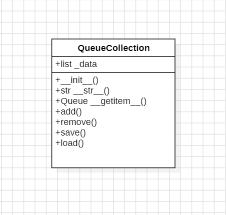
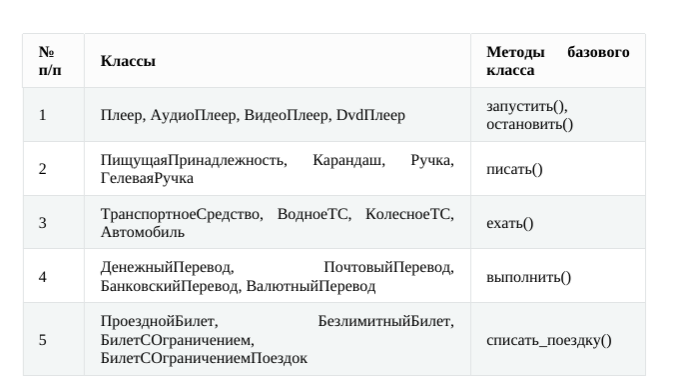
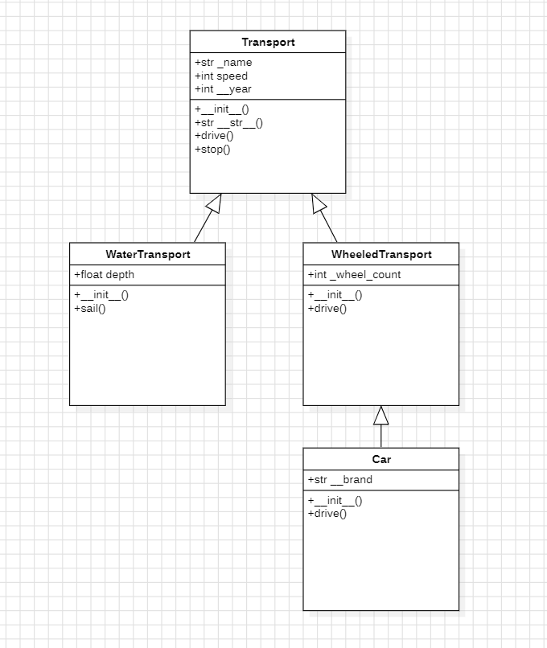

# Лабораторная работа на неделю 5
## **Тема**: Объектно-ориентированное программирование на Python 
### Студента группы ПИЖ-б-о-23-1(1) Дондаева Абу Умар-Пашаевича <br><br>
**Репозиторий Git:** https://github.com/Abu9541/pizh2311_dondaev  
**Вариант: 8**  
**Практическая работа:**  

*Задание 5:*  

Создайте класс-контейнер, который будет содержать набор объектов из предыдущей задачи. Например, класс VectorCollection будет содержать объекты класса Vector.  
Для класса-контейнера предусмотрите:  
· специальные методы:  

1) __ init __(self, ... ) - инициализация с необходимыми параметрами;  
2) __ str __(self) - представление объекта в удобном для человека виде;  
3) __ getitem __() - индексация и срез для класса-контейнера.  

· поля, методы, свойства:  

1) поле _data - содержит набор данных;  
2) метод add(self, value) - добавляет элемент value в контейнер;  
3) метод remove(self, index) - удаляет элемент из контейнера по индексу index;  
4) метод save(self, filename) - сохраняет объект в JSON-файл filename;
5) метод load(self, filename) - загружает объект из JSON-файла filename.

При выполнении задания необходимо построить UML-диаграмму классов приложения.  

*Ответ:*  
Код файла queue_collection.py:  
```python
import json
from OOP.Week_4.task_4_queue import Queue


class QueueCollection:
    """
    Класс-контейнер для хранения и управления набором объектов Queue.
    """

    def __init__(self, queues=None):
        """
        Инициализация контейнера.
        Принимает список объектов Queue и присваивает их полю _data.
        """
        if queues is None:
            self._data = []
        else:
            self._data = list(queues)

    def __str__(self):
        """
        Метод перегрузки класса: возвращение объекта в виде строки.
        Возвращает строковое представление контейнера.
        """
        return f"QueueCollection({[str(queue) for queue in self._data]})"

    def __getitem__(self, index):
        """
        Метод перегрузки класса: получение элемента по индексу.
        Принимает индекс возвращаемого элемента.
        """
        return self._data[index]

    def add(self, queue: Queue):
        """
        Добавляет объект Queue в контейнер.
        """
        if isinstance(queue, Queue):
            self._data.append(queue)
        else:
            raise TypeError("Можно добавлять только объекты типа Queue")

    def remove(self, index: int):
        """
        Удаляет объект Queue из контейнера по индексу.
        Принимает индекс удаляемого элемента.
        """
        if 0 <= index < len(self._data):
            self._data.pop(index)
        else:
            raise IndexError("Индекс вне диапазона")

    def save(self, filename: str):
        """
        Сохраняет контейнер в JSON-файл.
        """
        with open(filename, 'w') as f:
            json.dump([queue.items for queue in self._data], f)

    def load(self, filename: str):
        """
        Загружает контейнер из JSON-файла.
        """
        with open(filename, 'r') as f:
            data = json.load(f)
            self._data = [Queue(items) for items in data]

```  
Код файла main.py:  
```python
from OOP.Week_4.task_4_queue import Queue
from task_5_queue_collection import QueueCollection


if __name__ == "__main__":
    # Создание нескольких очередей
    q1 = Queue([1, 2, 3])
    q2 = Queue([4, 5, 6])
    q3 = Queue([7, 8, 9])

    # Создание контейнера и добавление очередей
    collection = QueueCollection()
    collection.add(q1)
    collection.add(q2)
    collection.add(q3)
    print("Контейнер после добавления очередей:", collection)

    # Индексация
    print("Первая очередь в контейнере:", collection[0])
    print("Последняя очередь в контейнере:", collection[-1])

    # Удаление очереди
    collection.remove(1)
    print("Контейнер после удаления второй очереди:", collection)

    # Сохранение и загрузка контейнера
    collection.save("queue_collection.json")
    print("Контейнер сохранен в файл queue_collection.json")

    new_collection = QueueCollection()
    new_collection.load("queue_collection.json")
    print("Контейнер загружен из файла:", new_collection)

```  
Вывод программы:  
 
Контейнер после добавления очередей: QueueCollection(['Queue([1, 2, 3])', 'Queue([4, 5, 6])', 'Queue([7, 8, 9])'])  
Первая очередь в контейнере: Queue([1, 2, 3])  
Последняя очередь в контейнере: Queue([7, 8, 9])  
Контейнер после удаления второй очереди: QueueCollection(['Queue([1, 2, 3])', 'Queue([7, 8, 9])'])  
Контейнер сохранен в файл queue_collection.json  
Контейнер загружен из файла: QueueCollection(['Queue([1, 2, 3])', 'Queue([7, 8, 9])'])  

UML-диаграмма классов:  
  

*Задание 6:*  
Выберите вариант:  
  
Далее:  
· выстройте классы в иерархию, продумайте их общие и отличительные характеристики и действия;  
· добавьте собственную реализацию методов базового класса в каждый из классов, предусмотрев:

1) необходимые параметры для базовых методов (например, в метод воспроизведения в Dvd-плеере можно передать абстрактный DVD-диск);  
2) необходимые поля для функционирования базовых методов(например, при остановке Dvd-плеера имеет смысл сохранить текущую позицию воспроизведения); классы должны содержать как минимум по одному общедоступному, не общедоступному и закрытому полю/методу;  
3) вывод на экран работы метода (например, вызов метода остановки в Dvd-плеере должен сообщать на экране, что плеер установлен на определенной позиции).  

· по желанию добавьте собственные методы в классы иерархии.  
Реализуйте все классы в отдельном модуле, а также создайте main.py, который бы тестировал все его возможности.  
По согласованию иерархия может быть расширена или выбрана самостоятельная индивидуальная тема для данной задачи.  
При выполнении задания необходимо построить UML-диаграмма классов приложения.  

*Ответ:*  
Код файла transport.py:  
```python
class Transport:
    """
    Базовый класс для всех транспортных средств.
    """

    def __init__(self, name: str, speed: int, year: int):
        """
        Инициализация транспортного средства.
        Принимает название, скорость и год выпуска ТС.
        """
        self._name = name  # Защищенное поле
        self.speed = speed  # Общедоступное поле
        self.__year = year  # Приватное поле

    def drive(self):
        """
        Базовый метод для движения транспортного средства.
        """
        print(f"{self._name} движется со скоростью {self.speed} км/ч.")

    def stop(self):
        """
        Базовый метод для остановки транспортного средства.
        """
        print(f"{self._name} остановился.")

    def __str__(self):
        """
        Перегрузка методов класса: возвращение объекта в виде строки.
        """
        return f"{self._name} (скорость: {self.speed} км/ч, год выпуска: {self.__year})"


class WaterTransport(Transport):
    """
    Класс для водных транспортных средств.
    """

    def __init__(self, name: str, speed: int, year: int, depth: float):
        """
        Инициализация водного транспортного средства.
        Принимает название, скорость, год выпуска и глубину плавания водного ТС.
        """
        super().__init__(name, speed, year)
        self.depth = depth

    def sail(self):
        """
        Метод для движения по воде.
        """
        print(f"{self._name} плывет по воде на глубине {self.depth} метров.")


class WheeledTransport(Transport):
    """
    Класс для колесных транспортных средств.
    """

    def __init__(self, name: str, speed: int, year: int, wheel_count: int):
        """
        Инициализация колесного транспортного средства.
        Принимает название, скорость, год выпуска и количество колес колесного ТС.
        """
        super().__init__(name, speed, year)
        self._wheel_count = wheel_count  # Защищенное поле

    def drive(self):
        """
        Переопределенный метод для движения колесного транспортного средства.
        """
        print(f"{self._name} едет на {self._wheel_count} колесах со скоростью {self.speed} км/ч.")


class Car(WheeledTransport):
    """
    Класс для автомобилей.
    """

    def __init__(self, name: str, speed: int, year: int, wheel_count: int, brand: str):
        """
        Инициализация автомобиля.
        Принимает название, скорость, год выпуска, количество колес и бренд автомобиля.
        """
        super().__init__(name, speed, year, wheel_count)
        self.__brand = brand  # Приватное поле

    def drive(self):
        """
        Переопределенный метод для движения автомобиля.
        """
        print(f'{self._name} "{self.__brand}" едет по дороге со скоростью {self.speed} км/ч.')

```
Код файла main.py:  
```python
from task_6_transport import Transport, WaterTransport, WheeledTransport, Car

if __name__ == "__main__":
    # Создание объектов
    boat = WaterTransport("Лодка", 50, 2010, 2)
    bicycle = WheeledTransport("Велосипед", 20, 2021, 2)
    car = Car("Автомобиль", 120, 2024, 4, "Toyota")

    # Демонстрация работы методов
    boat.drive()
    boat.sail()

    bicycle.drive()
    bicycle.stop()

    car.drive()
    car.stop()

    # Вывод строкового представления объектов
    print(boat)
    print(bicycle)
    print(car)

```
Вывод программы:  

Лодка движется со скоростью 50 км/ч.  
Лодка плывет по воде на глубине 2 метров.  
Велосипед едет на 2 колесах со скоростью 20 км/ч.  
Велосипед остановился.  
Автомобиль "Toyota" едет по дороге со скоростью 120 км/ч.  
Автомобиль остановился.  
Лодка (скорость: 50 км/ч, год выпуска: 2010)  
Велосипед (скорость: 20 км/ч, год выпуска: 2021)  
Автомобиль (скорость: 120 км/ч, год выпуска: 2024)  

UML-диаграмма классов:  
  
